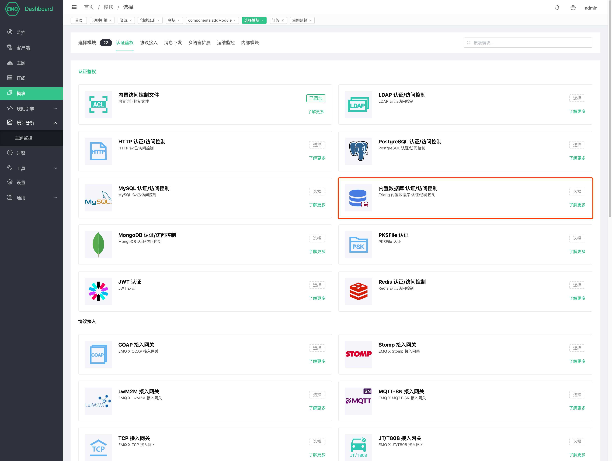
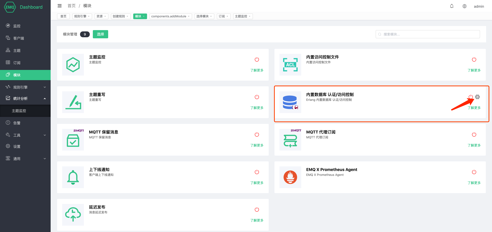
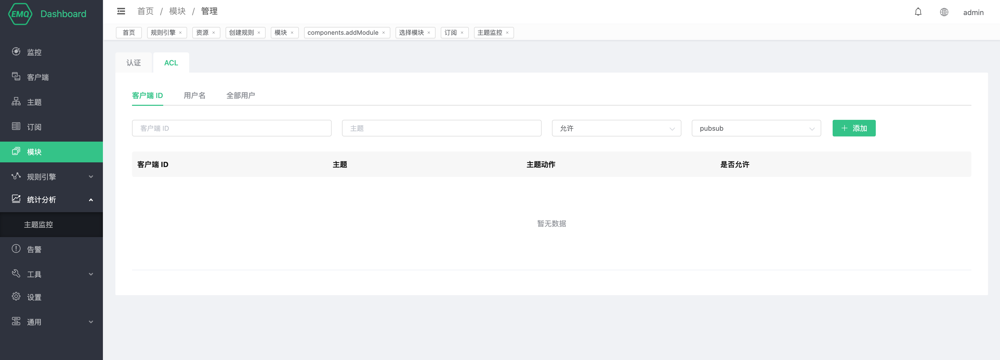

# 内置数据库 认证/访问控制

内置数据库认证使用 EMQ X 内置 Mnesia 数据库存储客户端 Clientid/Username 与密码，支持通过 HTTP API 管理认证数据。

内置数据库认证不依赖外部数据源，使用上足够简单轻量。

## 开启模块

打开 [EMQ X Dashboard](http://127.0.0.1:18083)，点击左侧的 “模块” 选项卡，选择添加

点击"选择",然后选择内置数据库认证模块

配置相关参数

最后点击“添加”按钮模块即可添加成功。

## 管理数据

内置数据库可以通过 dashboard 管理认证与访问控制数据

#### 认证数据

可以通过 dashboard 对认证数据进行管理

当客户端连接 EMQ X 时，内置数据库认证会获取 CONNENT 报文中的 Clientid 与 Username，然后数据库中记录的密码进行匹配，一旦匹配成功则认证成功。

内置数据库认证还支持 HTTP API 操作，详情请查看 [Mnesia 认证](https://docs.emqx.net/broker/latest/cn/advanced/auth-mnesia.html)。

#### 访问控制数据

可以通过 dashboard 对访问控制数据进行管理

当客户端向 EMQ X 进行发布、订阅、取消订阅时，访问控制可以根据内置数据库中提前设置的规则允许或拒绝该次操作。

内置数据库访问控制还支持 HTTP API 操作，详情请查看 [Mnesia ACL](https://docs.emqx.net/broker/latest/cn/advanced/acl-mnesia.html#mnesia-acl)。