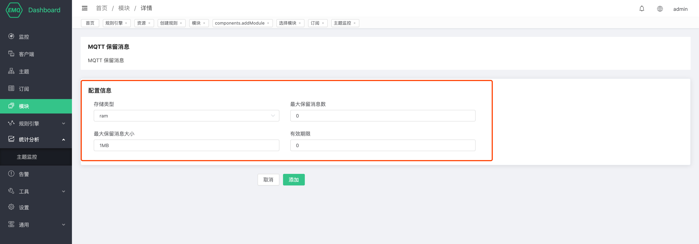

# MQTT 保留消息

## 简介

服务端收到 Retain 标志为 1 的 PUBLISH 报文时，会将该报文视为保留消息，除了被正常转发以外，保留消息会被存储在服务端，每个主题下只能存在一份保留消息，因此如果已经存在相同主题的保留消息，则该保留消息被替换。

当客户端建立订阅时，如果服务端存在主题匹配的保留消息，则这些保留消息将被立即发送给该客户端。借助保留消息，新的订阅者能够立即获取最近的状态，而不需要等待无法预期的时间，这在很多场景下非常重要的。

## 创建模块

内置访问控制模块默认启动，可以通过dashboard页面进行停止和更新。

打开 [EMQ X Dashboard](http://127.0.0.1:18083/#/modules)，点击左侧的 “模块” 选项卡：

配置相关参数

## 保留消息配置简介

| 配置项                         | 类型     | 可取值                   | 默认值 | 说明                                                         |
| ------------------------------ | -------- | ------------------------ | ------ | ------------------------------------------------------------ |
| 存储类型               | enum     | `ram`, `disc`, `disc_only` | ram |ram：仅储存在内存中； disc：储存在内存和硬盘中； disc_only：仅储存在硬盘中。|
| 最大保留消息数        | integer  | \>= 0                    | 0      | 保留消息的最大数量，0 表示没有限制。保留消息数量超出最大值限制后，可以替换已存在的保留消息，但不能为新的主题储存保留消息。 |
| 最大保留消息大小      | bytesize |                          | 1MB    | 保留消息的最大 Payload 值。Payload 大小超出最大值后 EMQ Ｘ 消息服务器会把收到的保留消息作为普通消息处理。 |
| 有效期限            | duration |                          | ０     | 保留消息的过期时间，0 表示永不过期。如果 PUBLISH 报文中设置了消息过期间隔，那么以 PUBLISH 报文中的消息过期间隔为准。 |
